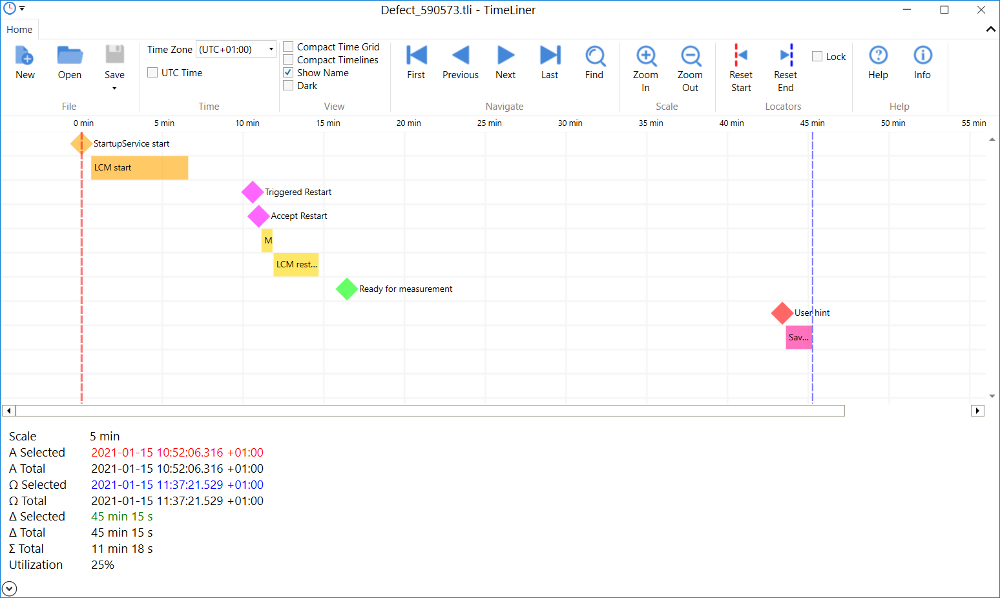

<p align="center">
  
</p>

# TimeLiner



TimeLiner is a Windows tool for visualizing time events.

This is a source-only open-source release. The repository does not provide
official precompiled executables, installers, portable packages, or binary releases.

I started working on TimeLiner in 2020 while analyzing software defects in my daily work.
Many of these analyses involved events from different sources, such as log files, traces,
or monitoring data, all related by time.

I looked for an existing tool that would let me draw timelines freely, place events
accurately in time, and measure distances between them. Since I could not find anything
that matched these requirements, I decided to write a small tool myself.

---

## Developer Quick Start

### Prerequisites

- Windows 11 x64
- .NET 10 SDK (including the Windows Desktop SDK)
- PowerShell

### Clone the Repository

```bash
git clone https://github.com/Pizzy72/TimeLiner.git
```

### Build and Test

Restore packages, build the x64 Release configuration, and run the complete test suite:

```powershell
dotnet restore TimeLiner.sln
dotnet build TimeLiner.sln --configuration Release --property:Platform=x64
dotnet test Test/TimeLinerTest/TimeLinerTest.csproj --configuration Release --property:Platform=x64 --no-build
```

### Run

After building, TimeLiner can be started:

- from Visual Studio, or
- with `dotnet run --project Source/TimeLiner/TimeLiner.csproj --configuration Release --property:Platform=x64`, or
- directly from the generated build output by running `TimeLiner.exe`.

The application is portable. User-specific settings are stored separately under:

```
%APPDATA%\TimeLiner\
```

### Documentation

Developer-oriented documentation is located in the `doc` folder.

Start with [TimeLiner – Overview](doc/overview.md)

---

## License

SPDX-License-Identifier: MIT

Copyright (c) 2020–2026 Christian Pistor

TimeLiner is licensed under the [MIT License](LICENSE). Runtime dependencies are
restored from NuGet; their notices are recorded in
[THIRD-PARTY-NOTICES.txt](THIRD-PARTY-NOTICES.txt).
