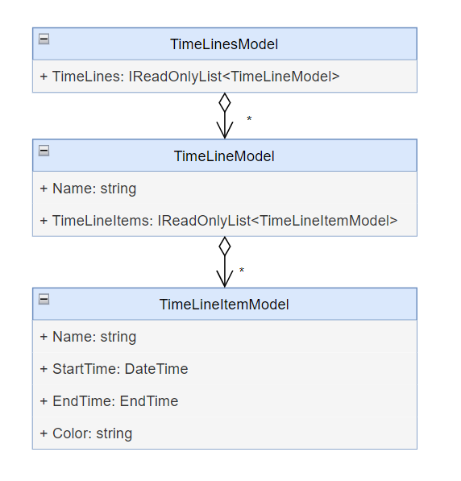

# Data Model

This document describes the core data model used by TimeLiner.
It focuses on structure, relationships, and design decisions rather than on
implementation details.

---

## Overview

The TimeLiner data model represents time-based information in a hierarchical form:

- A **TimeLinesModel** represents a complete document.
- A document contains one or more **TimeLineModel** instances.
- Each timeline contains zero or more **TimeLineItemModel** instances.

This structure maps directly to the visual representation used in the UI.

---

## TimeLinesModel

`TimeLinesModel` represents the root of the data model.

Responsibilities:

- managing the collection of timelines
- loading and saving timeline data from and to CSV files
- providing aggregate information (for example total item count)
- handling insertion, removal, and reordering of timelines

Key characteristics:

- timelines are stored internally in a mutable list
- the public API exposes read-only views where appropriate
- the model itself is UI-agnostic

The model also tracks the file path of the loaded document to support save operations.

---

## TimeLineModel

`TimeLineModel` represents a single timeline.

Responsibilities:

- storing the timeline name
- managing the collection of timeline items

Key characteristics:

- timeline items are stored internally in a list
- external access is provided via a read-only interface
- mutation is controlled through explicit add and remove methods

A timeline may exist without any items. This allows empty timelines to be represented
explicitly in both the model and the persisted CSV format.

---

## TimeLineItemModel

`TimeLineItemModel` represents a single time-based element within a timeline.

Properties include:

- name
- start time
- end time
- color

A key design aspect is the interpretation of start and end time:

- if start and end time are equal, the item represents a point-in-time event
- if start and end time differ, the item represents a time span

This distinction is purely data-driven and does not require additional flags.

---

## Time Representation

All times are stored internally as `DateTime` values in Coordinated Universal Time (UTC).

Consequences:

- consistent internal representation independent of user locale
- simplified comparison and ordering of time values
- explicit conversion required when displaying local time

The decision to normalize times to UTC is enforced during CSV import.

---

## CSV Persistence Model

Timeline data is persisted using a CSV-based format.

Key properties of the format:

- one row per timeline item
- repeated timeline names group items logically
- optional end time distinguishes events from spans
- optional color information

The CSV parser is intentionally strict:

- column count must match expectations
- invalid time formats result in errors
- unknown color names are rejected

This ensures early detection of invalid input data.

---

## Relationship to ViewModels

The data model is intentionally kept free of UI and presentation concerns.

ViewModels:

- wrap model instances
- provide additional state required for interaction and visualization
- project model data into UI-specific representations

This separation avoids direct binding from views to models and allows the model
to remain stable even if UI requirements change.

---

## Settings and Window State Models

In addition to timeline data, the application defines persistent models for
application and window settings.

### SettingsModel

`SettingsModel` stores user preferences such as:

- time display mode (UTC or local)
- grid layout options
- theme selection
- main window settings

It represents long-lived application state and is serialized using JSON.

### WindowSettingsModel

`WindowSettingsModel` stores:

- window position
- window size
- window state

A key design decision is that window geometry always reflects the last normal
(non-maximized) state. The maximized state is persisted separately.

---

## Performance Considerations

The data model itself is lightweight and efficient.

Performance limitations observed in the application are not caused by the model
structure but by:

- the number of model instances projected into ViewModels
- the resulting number of WPF bindings
- frequent update propagation

These aspects are discussed in more detail in [MVVM and Performance](mvvm-and-performance.md).

---

## Summary

The TimeLiner data model is:

- hierarchical and explicit
- independent of UI concerns
- closely aligned with the visual timeline representation

It favors clarity and correctness over aggressive optimization and serves as a
stable foundation for the rest of the application.
